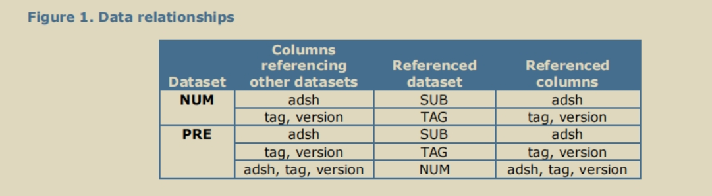

##  1. 概述

以下数据集提供了从提交至美国证券交易委员会（SEC）的 XBRL 申报文件中提取的信息，采用扁平化数据格式，方便用户更轻松地获取数据并开展分析。数据来源于申报主体提交给 SEC 的、经过 XBRL 标记的财务报表中的选定信息。

这些数据集目前包含 SEC 在申报主体提交的主要财务报表中呈现的季度和年度数值数据。同时还包含 SEC 的 EDGAR 系统中使用的部分附加字段（如标准产业分类代码 SIC），以辅助数据的使用。所有信息均直接提取自各注册申报主体提交的文件，数据状态为申报主体的 “提交原样（as filed）”。数据将按季度更新，季度最后一个工作日之后提交的文件数据，将纳入下一季度的更新发布中。

---

- **免责声明**

本财务报表数据集包含从各注册申报主体提交给 SEC 的结构化数据中衍生的信息，以及 SEC 生成的申报标识符。由于数据集由注册申报主体提供的信息衍生而来，SEC 无法保证数据集的准确性。此外，在数据提取与数据集汇编的过程中，也可能引入不准确或其他错误。

最后，数据集并未包含所有可用信息，包括与 SEC 申报文件相关的部分元数据。这些数据集旨在帮助公众分析 SEC 申报文件中的数据，但**不能替代申报文件本身**。投资者在做出任何投资决策前，应查阅 SEC 的完整申报文件。

---

从 XBRL 申报文件中提取的数据被整理为四个数据集，分别包含申报信息、数值信息、分类标准标签信息和报表展示信息。每个数据集均由行和列组成，以制表符分隔的 TXT 格式文件提供。数据集详情如下：

- SUB（提交数据集）：该数据集包含每条 XBRL 提交记录（SEC 在主要财务报表中呈现的数据），每条记录对应一次提交。数据集包含与提交行为和申报主体相关的字段信息，数据从 SEC 的 EDGAR 系统和申报主体提交给 SEC 的文件中提取。
- NUM（数值数据集）：该数据集包含每一条来自 SUB 数据集提交记录的、出现在 SEC 呈现的主要财务报表中的独立数值，每个数值对应一行数据。
- TAG（标签数据集）：该数据集包含每个数值标签的定义信息，包括标签描述（文档标签）、分类标准版本信息及其他标签属性。
- PRE（展示数据集）：该数据集提供了标签和数值在 SEC 呈现的主要财务报表中的展示方式信息。

## 2 范围

- 美国证券交易委员会（SEC）呈现的主要财务报表（资产负债表、利润表、现金流量表、权益变动表和综合收益表）中的数值数据，以及这些报表的页脚附注数据；
- 包含 SEC 呈现财务报表的 XBRL 申报文件（例如：10-K、10-Q、20-F、40-F）；
- 申报提交时间范围为 2009 年 4 月 15 日至 “数据截止日期”（含当日）（SEC 网站上有一个名为`2009q1.zip`的文件，其中仅包含列标题、无数据行，该文件仅用于确保该年份之前的所有年份都包含 4 个季度的压缩文件）。

所有数值数据均为 “申报原样（as filed）”。

## 3 数据组织方式

​     请注意，本数据集代表的是**未经过修正、“申报原样”（as filed）的 EDGAR 季度 / 年度文件提交记录**，包含多个报告期间的数据（包括对历史提交文件的修正文件）。这种原始提交格式的数据，相比其他公开格式，可能存在冗余、不一致或差异问题。本数据共包含四个数据集：

1. **SUB（提交数据集）**：识别数据集中所有经 SEC 呈现、且包含财务报表金额的 EDGAR 提交记录。每一行的唯一（主键）为 **adsh**，即 EDGAR 文件编号，为一个 20 位字符的编号，第 11 位和第 14 位为短横线。

   

2. **TAG（标签数据集）**：包含所有提交文件中使用的数值标签（包括标准标签和自定义标签）。每一行的唯一键由以下字段组合而成：

   1. `tag` —— 申报主体使用的标签名称
   2. `version` —— 若为标准标签，此字段为其所属的分类标准；若为自定义标签，则此字段等于`adsh`（文件编号）。

   

3. **NUM（数值数据集）**：包含所有经 SEC 呈现、列示于主要财务报表中的 XBRL 数值事实。每一行的唯一键由以下字段组合而成：

   1. `adsh` —— EDGAR 文件编号

   2.  `tag` —— 申报主体使用的标签

   3.  `version` —— 若为标准标签，此字段为其所属的分类标准；若为自定义标签，则此字段等于`adsh`（文件编号）

   4. `ddate` —— 报告期间结束日期

   5.  `qtrs` —— 报告期间的季度数（时长）

   6.  `uom` —— 计量单位（Unit of Measure）

   7.  `segments` —— 用于表示维度轴和成员披露的 XBRL 标签（如分部报告）

   8.  `coreg` —— 母公司注册主体的共同注册方（如适用）

      

4. **PRE（展示数据集）**：该数据集提供了申报主体为主要财务报表中每一项行项目分配的文本名称、行项目的展示顺序，以及为其分配的标签。每一行的唯一键由以下字段组合而成：

   1. `adsh` —— EDGAR 文件编号（Accession Number）
   2. `report` —— 报表内报告的序号
   3. `line` —— 报告内行项目的序号

### 数据集关联关系说明

各数据集之间的关系如图 1 所示：

- NUM 数据集中的文件编号（`adsh`）可用于在 SUB 数据集中查询对应的申报信息。
- NUM 中的每一行数据，都由申报主体使用一个`tag`进行标记，该标签的详细信息可在 TAG 数据集中找到。
- NUM 中的每一行数据，都会出现在 PRE 数据集所描述的一份或多份报表行项目中。

### 说明

SEC 网站文件夹 `http://www.sec.gov/Archives/edgar/data/{cik}/{accession}/` 始终会包含某一次提交对应的所有文件，其中 `{accession}` 是移除了短横线（`-`）后的 `adsh`（EDGAR 文件编号）。

## 4 文件格式

上述四个数据集均采用单一编码格式提供，具体如下：

制表符分隔值文件（`.txt`）：采用 UTF-8 编码、制表符分隔、以换行符（`\n`）作为行结束符；文件首行为列名，列名均为小写字母。

## 5 表格定义

- 见英文文本

## 5.2 TAG(Tags)
TAG 数据集包含所有标准分类标签，而不仅仅是截至目前申报中出现的标签，同时也包含申报中定义的所有自定义分类标签。数据来源为 “已申报版本” 的 XBRL 文件。
标准标签源自原始申报提交日时，SEC 在 https://www.sec.gov/info/edgar/edgartaxonomies.shtml 发布的分类体系。
